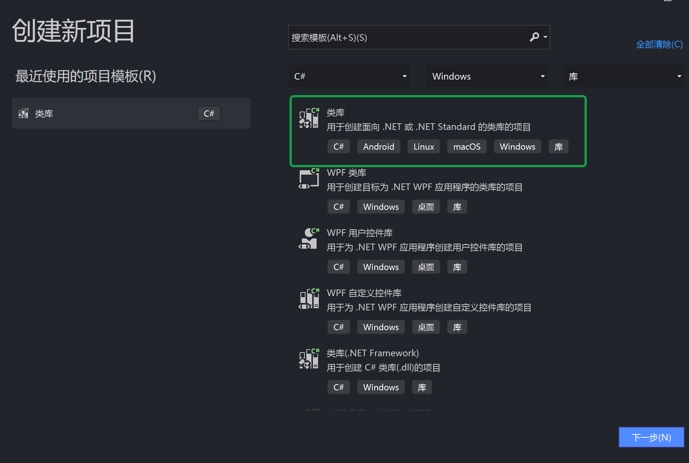
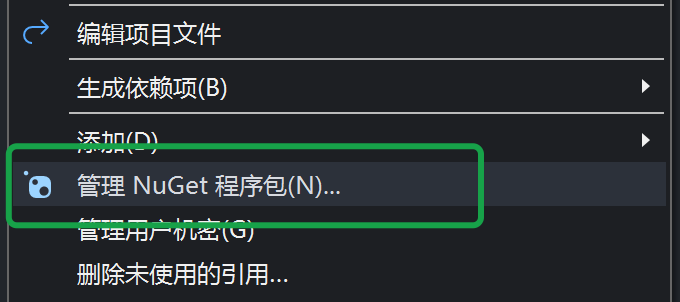
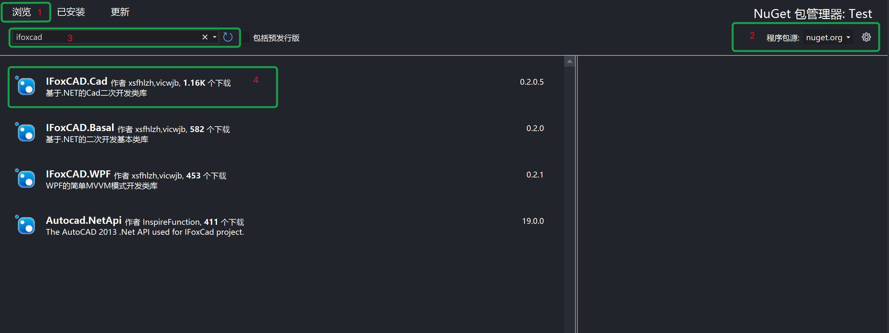

# IFoxCAD

#### 释义
IFox中：
IF：为Inspire Function（中文名：跃动方程）的首字母缩写
Fox：起初`雪山飞狐`（又狐哥）在明经论坛发布了[开源库](http://bbs.mjtd.com/thread-75701-1-1.html)，后`落魄山人`（又小山山）基于狐哥的开源库创建了NFox开源项目，后经多重原因NFox被废弃，小山山又开创新开源项目，取名为`IF+Fox=IFox`，一语双关，简洁而不简单。

#### 介绍

基于.NET的Cad二次开发类库。

可以加群交流：


#### 软件架构及相关说明

- [软件架构说明](/docs/关于IFoxCAD的架构说明.md)
- [扩展函数说明](/docs/关于扩展函数的说明.md)

#### 编译 IFox 源码工程

由于vs2022抛弃了某几个net版本，所以我们同时安装vs2019和vs2022，然后使用vs2022;
其中的原因是vs2019拥有全部net版本,而vs2022拥有最新的分析器和语法.

#### 让 IFox 作为您的子模块

IFox的[jing分支](https://gitee.com/inspirefunction/ifoxcad/tree/jing/)是一个多cad版本分支,您可以利用此作为您的[git项目子模块](https://www.cnblogs.com/JJBox/p/13876501.html#_label13).

子模块是以`共享工程`的方式加入到您的工程的,其为`IFoxCAD.Cad.Shared`:

1. 千万不要用`IFoxCAD.Cad`内的工程作为引用,否则您将遭遇cad加载失效.

2. 一些全局命名空间的缺少,我们也建议您使用全局命名空间来补充,
   您只需要按照`IFoxCAD.Cad`的`GlobalUsings.cs`文件一样添加就好了.
3. 若您使用acad08版本,需要在您的工程中设置`ac2008`和`ac2009`(大小写敏感)两个预定义标签.
   方能启用08工程中缺少的09工程才有的类.
   同时我们在`IFoxCAD.Cad`中提供了这两个例子.


#### IFoxCad 项目模版

可以在vs扩展菜单-管理扩展中搜索ifoxcad，即可安装项目模板。使用项目模版可以方便的创建支持多目标多版本的使用ifoxcad类库的项目和类。如果无法在vs的市场里下载，就去上面的QQ群里下载。

#### 安装教程

1. 新建net standard 类库
2. 修改项目`.csproj`的`TargetFrameworks`为net45，保存重加载项目，这里需要注意和cad版本对照.
3. 右键项目，管理nuget程序包，搜索ifoxcad，安装最新版就可以了.

#### 使用说明

1. 快速入门
   
   - 打开vs，新建一个standard类型的类库项目，**注意，需要选择类型的时候一定要选standard2.0** 
   
   - 双击项目，打开项目文件：
     
     - 修改项目文件里的`<TargetFramework>netcore2.0</TargetFramework>`为`<TargetFrameworks>NET45</TargetFrameworks>`。其中的net45，可以改为NET45以上的标准TFM（如：net45、net46、net47等等）。同时可以指定多版本。具体的详细的教程见 [VS通过添加不同引用库，建立多条件编译]( https://www.yuque.com/vicwjb/zqpcd0/ufbwyl)。
     
     - 在 `<PropertyGroup> xxx  </PropertyGroup>` 中增加 `<LangVersion>preview</LangVersion>`，主要是为了支持最新的语法，本项目采用了最新的语法编写。项目文件现在的内容类似如下：
     
     ```xml
     <Project Sdk="Microsoft.NET.Sdk">
        <PropertyGroup>
            <TargetFramework>net45</TargetFramework>
            <LangVersion>preview</LangVersion>
        </PropertyGroup>
     </Project>
     ```
   
   - 右键项目文件，选择管理nuget程序包。
   
   - 在nuget程序里搜索**ifoxcad**，直接选择最新的版本（如果您是 **net40** 或者 **net35** 的用户，可以安装 **0.1.6** 版本），然后点击安装**IFoxCAD.Cad**，nuget会自动安装ifoxcad依赖的库。(按下图绿色框框里选择浏览，程序包来源选择nuget.org，安装IFoxCAD.Cad包。IFoxCAD.Basal是IFoxCAD.Cad的依赖项会自动安装，如果要开发wpf界面的话，可以安装IFoxCAD.WPF，提供了简单的mvvm支持)
   
   - 添加引用
   
   ```c#
   using Autodesk.AutoCAD.ApplicationServices;
   using Autodesk.AutoCAD.EditorInput;
   using Autodesk.AutoCAD.Runtime;
   using Autodesk.AutoCAD.Geometry;
   using Autodesk.AutoCAD.DatabaseServices;
   using IFoxCAD.Cad;
   ```
   
   - 添加代码
   
   ```c#
   [CommandMethod("hello")]
   public void Hello()
   {
    using var tr = new DBTrans();
    var line1 = new Line(new Point3d(0, 0, 0), new Point3d(1, 1, 0));
    tr.CurrentSpace.AddEntity(line1);
    // 如果您没有添加<LangVersion>preview</LangVersion>到项目文件里的话：按如下旧语法：
    // using(var tr = new DBTrans())
    // {
    //     var line1 = new Line(new Point3d(0, 0, 0), new Point3d(1, 1, 0));
    //     tr.CurrentSpace.AddEntity(line1);
    // }
   }
   ```
   
   这段代码就是在cad的当前空间内添加了一条直线。
   
   - F6生成，然后打开cad，netload命令将刚刚生成的dll加载。
   
   - 运行hello命令，然后缩放一下视图，现在一条直线和一个圆已经显示在屏幕上了。

2. [事务管理器用法](/docs/DBTrans.md)

3. [选择集过滤器用法](/docs/SelectionFilter.md)

4. [符号表用法](/docs/SymbolTable.md)

5. [WPF支持](/docs/WPF.md)

6. 天秀的自动加载与初始化
   
   为了将程序集的初始化和通过写注册表的方式实现自动加载统一设置，减少每次重复的工作量，类裤提供了`AutoRegAssem`抽象类来完成此功能，只要在需要初始化的类继承`AutoRegAssem`类，然后实现`Initialize()` 和`Terminate()`两个函数就可以了。
   特别强调的是，一个程序集里只能有一个类继承，不管是不是同一个命名空间。
   
   但是为了满足开闭原则，使用特性进行分段初始化是目前最佳选择
   
   ```c#
    using Autodesk.AutoCAD.Runtime;
    using IFoxCAD.Cad;
    using System;
    using System.Reflection;
   
   /*
    * 自动执行接口
    * 这里必须要实现一次这个接口,才能使用 IFoxInitialize 特性进行自动执行
    */
   public class CmdINI : AutoRegAssem
   {
       // 这里可以写任何普通的函数，也可以写下面 AutoTest 类里的实现了 IFoxInitialize 特性的初始化函数
       // 继承AutoRegAssem的主要作用是写注册表用来自动加载dll，同时执行实现了 IFoxInitialize 特性的函数
       // 注意这里的自动执行是在cad启动后，加载了dll之后执行，而不是运行命令后执行。
   
       [IFoxInitialize]
       public void InitOne()
       { 
           //TODO 您想在加载dll之后自动执行的函数
           // 可以随便在哪里类里 可以多次实现 IFoxInitialize 特性
       }
   
   }
   
   //其他的类中的函数:
   //实现自动接口之后,在任意一个函数上面使用此特性,减少每次改动 CmdINI 类
   public class AutoTest
   {
       [IFoxInitialize]
       public void Initialize()
       { 
           //TODO 您想在加载dll之后自动执行的函数
       }
       [IFoxInitialize]
       public void InitTwo()
       { 
           //TODO 您想在加载dll之后自动执行的函数
           // 可以随便在哪里类里 可以多次实现 IFoxInitialize 特性
       }
       [IFoxInitialize(isInitialize: false)] // 特性的参数为false的时候就表示卸载时执行的函数
       public void Terminate()
       {
            //TODO 您想在关闭cad时自动执行的函数
       }
   }
   ```
   
   
   
7. 天秀的打开模式提权

   由于cad的对象是有打开模式，是否可写等等，为了安全起见，在处理对象时，一般是用读模式打开，然后需要写数据的时候在提权为写模式，然后在降级到读模式，但是这个过程中，很容易漏掉某些步骤，然后cad崩溃。为了处理这些情况，内裤提供了提权类来保证读写模式的有序转换。

   ```c#
   using(line.ForWrite()) //开启对象写模式提权事务
   {
     //处理代码
   } //关闭事务自动处理读写模式
   ```

8. 未完待续。。。。

