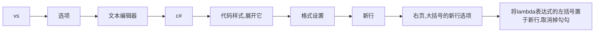
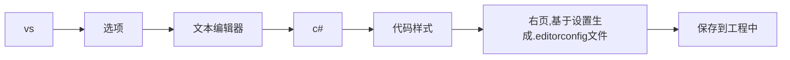

# IFox工程规范

## 代码规范

### 0x01 分离逻辑代码和业务代码

Good:

```c#
foreach (xx in yyy)
  if (xx == "a")
  {
     业务();
     break;
  }
```

Bad:

```c#
bool flag = false;
foreach (xx in yyy)
  if (xx == "a")
  {
     业务();
     flag = true;
     break;
  }
if(!flag)
  其他业务();
```
Good:

```c#
bool flag = false;
foreach (xx in yyy)
  if (xx == "a")
  {
     flag = true;
     break;
  }
if(!flag)
  其他业务();
else
  业务();
```

主要原因是统一业务在判断分支上,能够更清晰分离逻辑代码和业务代码.


### 0x02 分离逻辑代码和业务代码


写代码的时候总是要把业务代码独立成一个逻辑处理.这样主要是为了防止业务耦合:
 例如: for {业务1,业务2,业务1,业务2....}
如果有这样的逻辑,那么我们看代码的时候总是认为业务2某种条件必须要跟着业务1
优化代码的人一看:这代码就不能动了!!
相信我,若干年后的你就是这个优化代码的人.


### 0x03 .editorconfig 配置要求

c#的代码风格是两个大括号隔行

```c#
if()
{
   ...
}
```

但是,由于vs没有制作好的原因,导致`委托箭头`代码格式化总是会出现格式化错误.
所以我们推荐用 .editorconfig 文件约束这个`委托箭头`



保存为 .editorconfig 文件:



这样每次打开工程vs会自动识别这个 .editorconfig 文件,而不会用你电脑默认设置的.


## 文件管理规范

### 0x01 (软性)

.git文件夹通常和.sln放一起,
主要原因是我们习惯同时在vs控制台和git bash使用git命令
.vs控制台的默认所在路径会是sln,
为了避免输入不同的相对路径时候发生错误,因而规定


### 0x02

git子模块往往写入到一个统一的文件夹: assets
主要是明白哪些是人家的,哪些是我的.


