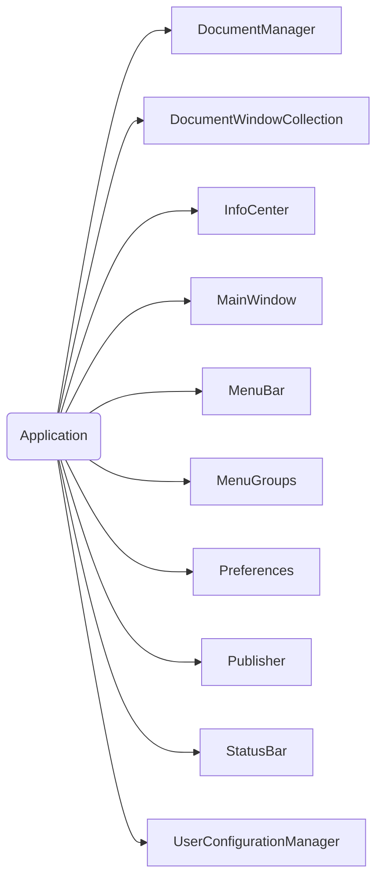
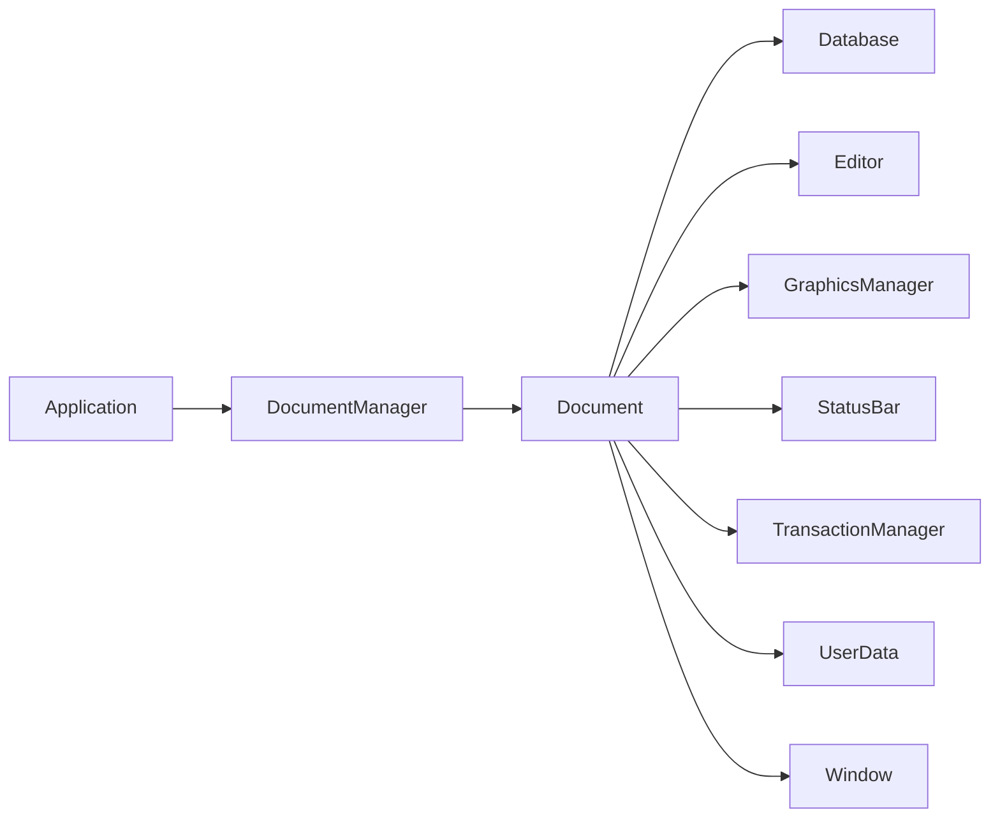
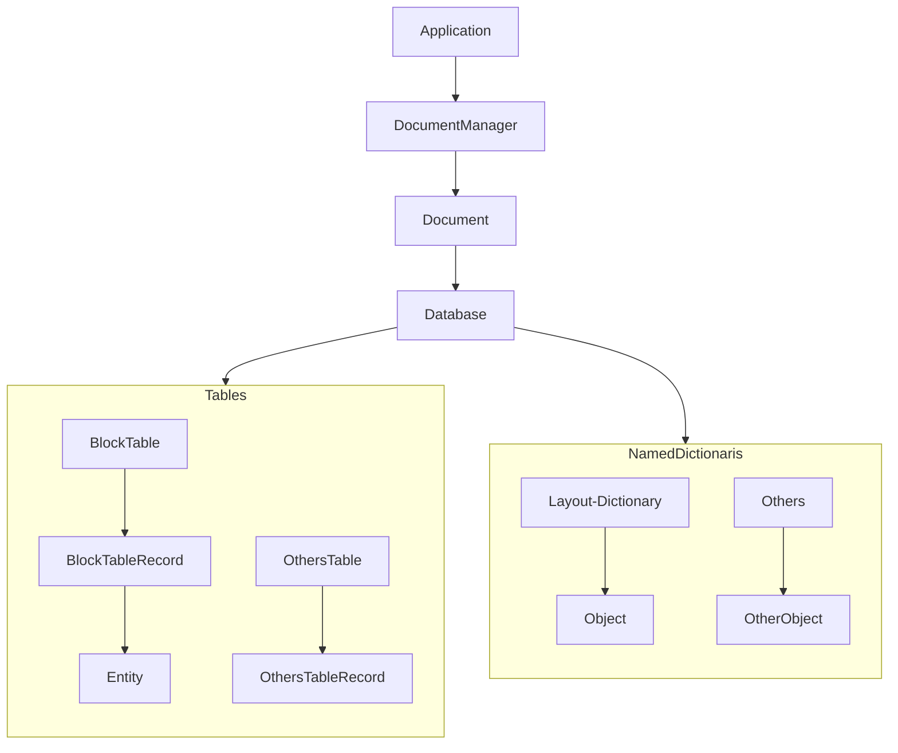
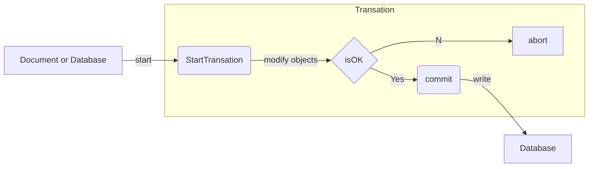

# IFoxCAD的架构说明

AutoCAD 的 .net api 的架构是如下这样的：

1. Application 对象

2. Document 对象

3. Database 对象

4. Transation 对象

IFoxCAD是基于NFOX类库的重制版，主要是提供一个最小化的内核，即DBTrans、SymbolTable、ResultData、SelectFilter等基础类，其他的功能都通过扩展方法的方式来实现。

其重制的原因在于原NFOX类库的封装过于厚重，初学者理解起来困难，重制版希望做到最小化的内核，方便理解，然后丰富的扩展函数来实现大量的功能，便于学着现有的教程中那套基于Database扩展函数封装思路的初学者快速的入门。

## 一、组织结构图

- IFoxCAD
  
  - IFoxCAD.Basal - cad以外常用的类库
  
  - LinqEx - linq扩展类
  
  - LoopList - 环链表
  
  - IFoxCAD.Cad - cad相关的类库
  
  - Runtime - 包含系统级别的功能
    
    - AcadVersion - cad版本号类
    - AssemInfo - 程序集信息
    - AutoRegAssem - 程序集加载类型
    - DBTrans - 事务处理类
    - Env - 系统管理类
    - SymbolTable - 符号表类
  
  - ExtensionMethod - 扩展函数，以Ex结尾
    
    - SymbolTableEx - 符号表扩展类
    - SymbolTableRecordEx - 符号表记录扩展类 
    - EntityEx - 实体扩展类   
    - 。。。。。。  
  
  - ResultData
    
    - 待补充。。。
  
  - SelectionFilter
    
    - 待补充。。。
  
  - IFoxCAD.WPF - wpf的mvvm模式相关的类库
  
  ## 二、关于DBTrans类的说明

### 2.1 为什么要构建DBTrans类？

主要是为封装cad的Transaction类的，为何如此封装有如下原因：

- 虽然可以继承Transaction类，但是由于其构造函数为受保护的，同时其参数不能很方便的传递，所以即便cad在使用的时候也是调用TransactionManager的StartTransaction方法，所以直接继承Transaction类进行扩展并不方便。
- 由于cad实体图元和非实体图元几乎都存储在数据库里，也就是Database里，所以目前市面上的教程基本都是基于Database的扩展函数进行封装。但是cad本身其实推荐的都是利用事务（Transaction）来对数据库进行增删改的操作，但是默认的Transaction类仅仅提供了几个方法，每次操作数据库或者修改图元都需要手动进行大量的重复性操作，这部分操作几乎都被封装为函数活跃于每个重复的轮子里。那么狐哥转变思路，继续不考虑数据库的操作而是延续cad的思路，着重封装关于Transaction的操作。
- 想到再说。。。

### 2.2 关于DBTrans类的具体构成元素的意义

DBTrans类里基本的封装就是Transaction，然后是Document、Database、Editor、符号表、命名字典等，而这些其实都是cad二次开发关于图元操作经常打交道的概念。

DBTrans的每个实例都具有这些属性，而这些属性就对应于cad的相关类库，通过这些属性就可以对数据进行相应的操作。特别是符号表中最常用的就是块表，通过对块表的操作来实现添加图元等。

### 2.3 DBTrans类应该具有的成员

为了尽量少的封装方法，减少类的复杂度，目前计划的方法主要为：

属性:

- Top  ---返回当前事务
- Database  ---数据库
- Document  ---文档
- Editor  ---命令行
- Trans  ---事务管理器

构造函数:

- DBTrans(Document doc = null, bool commit = true)
- DBTrans(Database database, bool commit = true)
- DBTrans(string fileName, bool commit = true)

符号表:

- BlockTable 块表
- LayerTable 层表
- TextStyleTable 文字样式表
- RegAppTable 注册应用程序表
- DimStyleTable 标注样式表
- LinetypeTable 线型表
- UcsTable 用户坐标系表
- ViewTable 视图表
- ViewportTable 视口表

方法:

- GetObject  ---根据对象id获取图元对象
- 。。。

接口:

- Abort ---放弃事务
- Commit ---提交事务
- Dispose --- 执行与释放非托管资源

## 三、 关于SymbolTable类的说明

### 3.1 为什么要构建SymbolTable类

主要是为了统一处理9个符号表，具体原因如下：

- 其实cad的api对于符号表都是继承自SymbolTable类，符号表记录都是继承自SymbolTableRecord类，所以其实这个自定义的类叫SymbolTable是和cad的内部api有命名上的冲突的，希望给我给个贴近自定义的理念的类名。
- cad的默认api关于符号表和符号表记录是隔离关系的，就是说符号表和符号表记录在api上是没有关系的，只是数据库里每个符号都映射着相应的符号表记录，所以为了对应符号表和符号表记录，写了SymbolTable类。
- 通过这个类，就可以统一的处理符号表和符号表记录了，比如层表的处理就从原来首先获取层表对象->新建层表记录对象->打开层表的写模式->添加层表记录，变成新建层表的关联类实例->添加层表记录。
- 有了这个类，DBTrans类就可以直接通过属性获取符号表的关联关系，然后进行符号表的处理。

### 3.2 SymbolTable类应该具有的成员

属性:

- CurrentSymbolTable  ---当前的符号表对象

方法:

- this  ---索引器符号表记录函数
- Add  ---添加符号表记录函数
- Remove --- 删除符号表记录函数(层表请使用扩展方法Delete)
- Change --- 修改符号表记录函数
- GetRecord --- 获取符号表记录
- GetRecordFrom --- 从源数据库拷贝符号表记录
- Has --- 判断符号表是否有符号表记录的函数
- 。。。

特殊说明：当符号表为块表时，上述函数实际操作的是块定义、属性定义等。所以为了添加图元，需要特殊写法，原因在于cad的实体都是存在符号表记录里的，通常为模型这个块表记录。

# 慢慢完善，想到哪写到哪。。。
